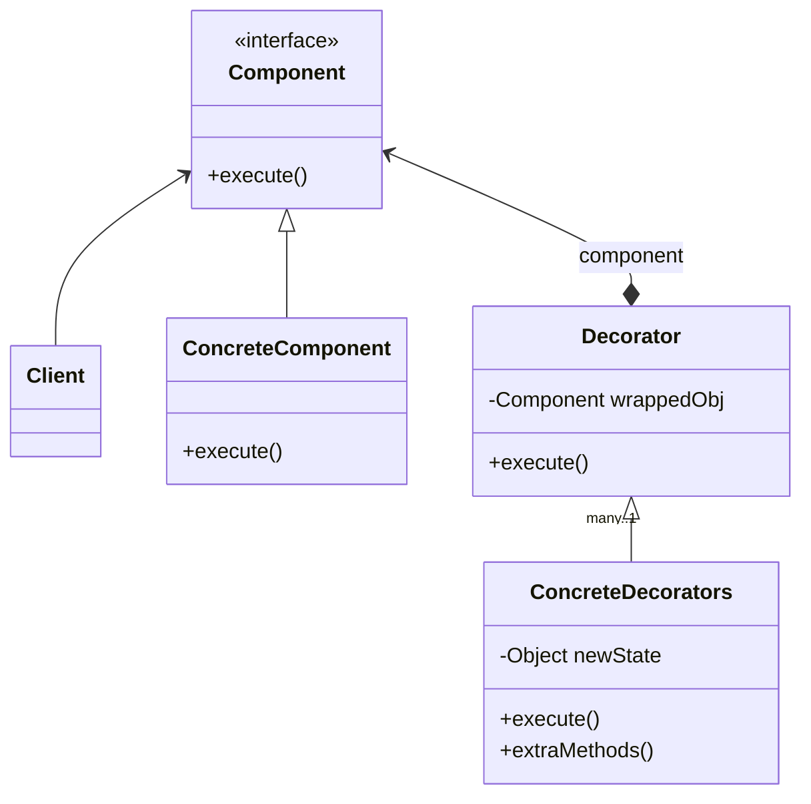

# Decorator Pattern [WIP]

Attach new behaviors to objects dynamically at runtime by placing these objects inside special wrapper objects that contain the behaviors. 

## Structure

1. The **Component** declares the common interface for both wrappers and wrapped objects.

2. **Concrete Component** is a class of objects being wrapped. It defines the basic behavior, which can be altered by decorators.

3. The **Decorator** class has a field for referencing a wrapped object. The field's type should be declared as the component interface, so it can contain both concrete components and decorators. The base decorator delegates all operations to the wrapped object.

4. **Concrete Decorators** define extra behaviors that can be added to components dynamically. Concrete decorators override methods of the decorator and execute their behavior either before or after calling the parent method.

5. The **Client** can wrap components in multiple layers of decorators, as long as it works with all objects via the component interface.

## Applicability

## Pros

## Cons

## References
- https://refactoring.guru/design-patterns/observer

- https://www.oreilly.com/library/view/head-first-design/9781492077992/