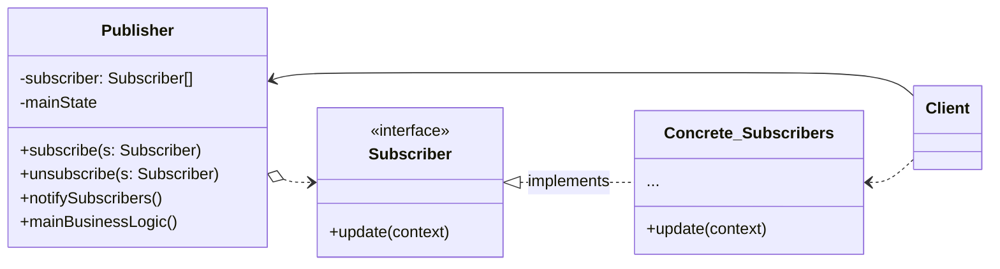

# Observer Pattern [WIP]

Defines a one-to-many dependency between objects so that when one object changes state, all of its dependents are notified and updated automatically.

## Structure

1. The **Publisher** issues events of interest to other objects. There events occur when the publisher changes its state or executes some behaviors. Publishers contain a subscription infrastructure that lets new subscribers join and current subscribers leave the list.

2. When a new event happens, the publisher goes over the subscription list and calls the notification method declared in the subscriber interface on each subscriber object.

3. The **Subscriber** interface declares the notification interface. In most cases, it consists of a single `update` method. The method may have several parameters that let the publisher pass some event details along with the update.

4. **Concrete Subscribers** perform some actions in response to notifications issued by the publisher. All of these classes must implement the same interface so the publisher isn't coupled to concrete classes.

5. Usually, subscribers need some contextual information to handle the update correctly. For this reason, publishers often pass some context data as arguments of the notification method. The publisher can pass itself as an argument, letting the subscriber fetch any required data directly.

6. The **Client** creates publisher and subscriber objects separately and then registers subscribers for publisher updates.

## Applicability
- When changes to the state of one object may require changing other objects, and the actual set of objects is unknown beforehand or changes dynamically
- When some objects in your app must observe others, but only for a limited time or in specific cases

## Pros
- _Open/Closed Principle_. You can introduce new subscriber classes without having to change the publisher's code (and vice verse if there's publisher's code)
- You can establish relations between objects at runtime

## Cons
- Subscribers are notified in random order

## References
- https://refactoring.guru/design-patterns/observer

- https://www.oreilly.com/library/view/head-first-design/9781492077992/