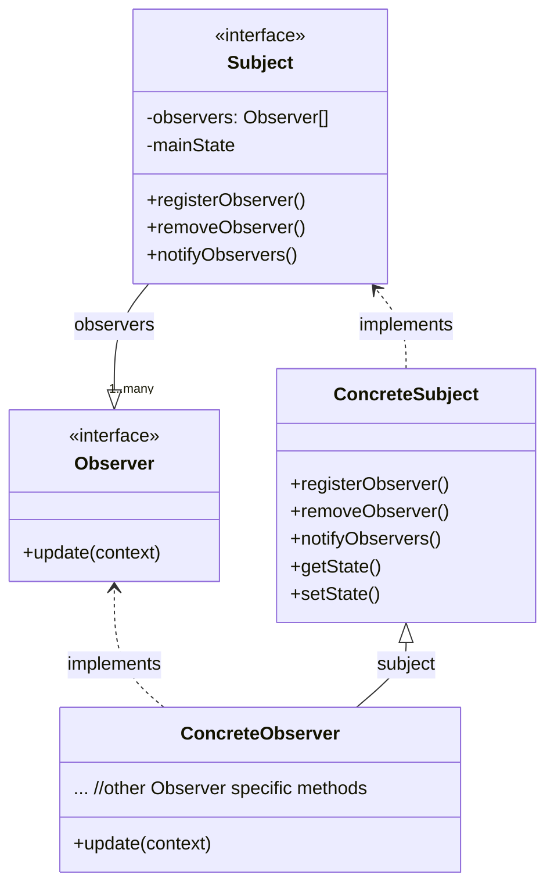

# Observer Pattern

Defines a one-to-many dependency between objects so that when one object changes state, all of its dependents are notified and updated automatically.

## Structure

1. The **Subject** interface allows objects to register as observers and also remove themselves from being observers.

2. Each **Subject** can have many **Observers**.

3. All potential observers need to implement the **Observer** interface. This interface has just one method, `update()`, that is called when the **Subject's** state changes.

4. **Concrete Observers** can be any class that implements the **Observer** interface.

5. The **Concrete Subject** may also have methods for setting and getting its state.

6. A **Concrete Subject** always implements the **Subject** interface. In addition to the register and remove methods, the concrete subject implements a `notifyObservers()` method that is used to update all the current observers whenever state changes.

## Applicability
- When changes to the state of one object may require changing other objects, and the actual set of objects is unknown beforehand or changes dynamically
- When some objects in your app must observe others, but only for a limited time or in specific cases

## Pros
- _Open/Closed Principle_. You can introduce new observer classes without having to change the subject's code (and vice versa)
- You can establish relations between objects at runtime

## Cons
- Observers are notified in random order

## References
- https://refactoring.guru/design-patterns/observer

- https://www.oreilly.com/library/view/head-first-design/9781492077992/